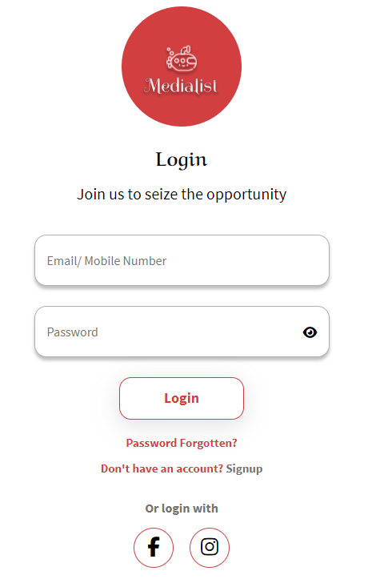
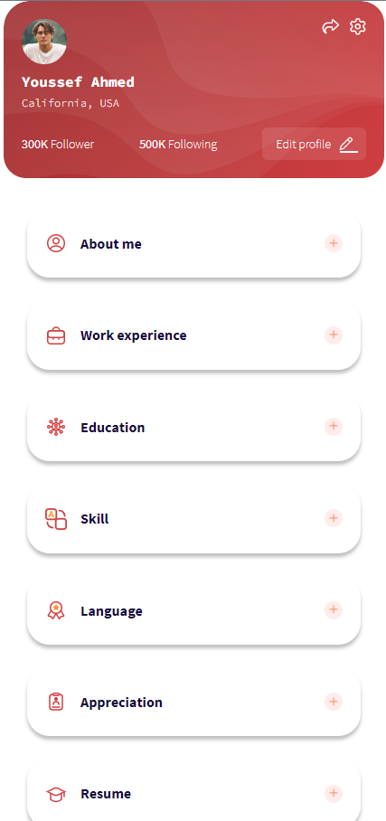
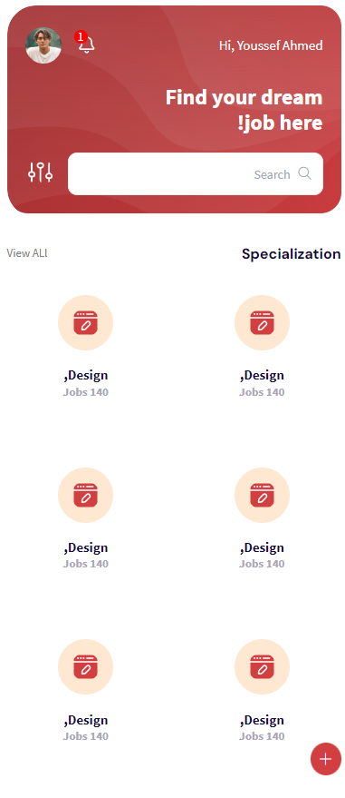

# MediaList: A Job Search Platform (Mobile-Optimized)
MediaList is a web application designed to streamline the job search process. It features 40 unique pages, allowing users to search for jobs, filter results based on their needs, and potentially connect with potential employers (depending on your implementation).

## Live Demo:
Please note: MediaList is optimized for mobile browsing. For a better preview, access the demo from your mobile device.
- https://zaki-abed.github.io/medialist/

## Tech Stack:

- HTML
- CSS
- JavaScript
- jQuery

Feel free to explore the code and contribute to the project!

## Screenshots
**Login Page**

**Home Page**

**Profile Page**

**Specialization Page**

